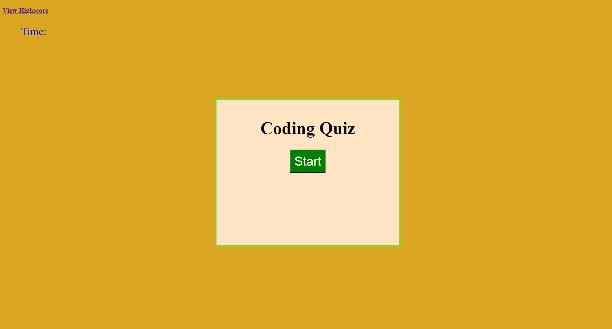
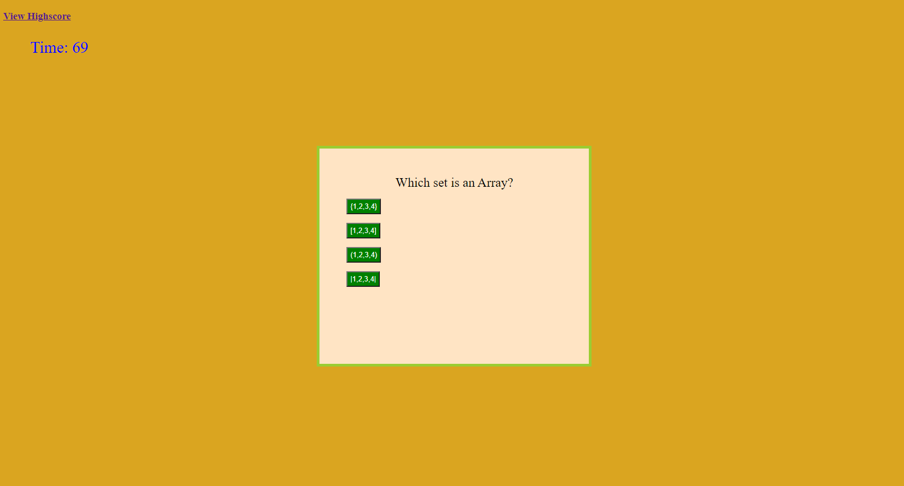
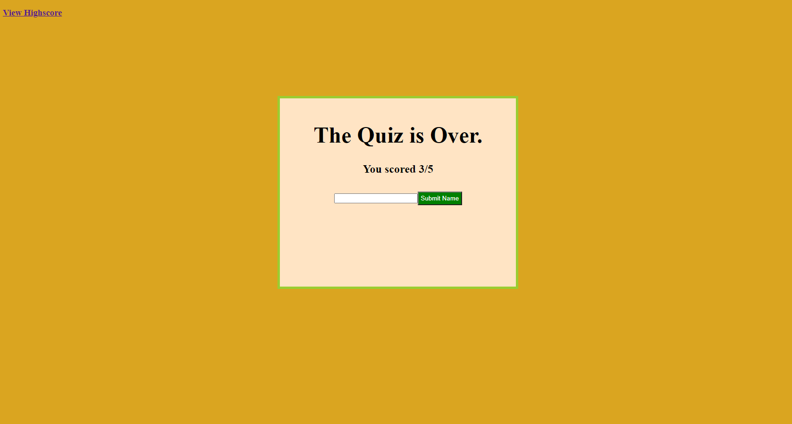

# Code_Quiz

[Code Quiz Repository](https://github.com/jceb30198/Code_Quiz)

[Code Quiz Link](https://jceb30198.github.io/Code_Quiz/)

## Program

- The code starts when the start button is clicked.

- The timer starts with 75 seconds.
- When the wrong answer is clicked then the timer subtracts 5 seconds and moves on.

- At the end the final score is shown and you can input your name into a form to save on local storage.
- Then you are sent to the highscore page.

## Issues with the Code
- When I try to grab the local storage to post on the highscore page it does not work.
- I am still trying to work on this until I am happy with the outcome.